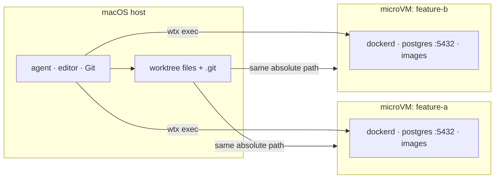

<div align="center">

# wtx

**どのworktreeにも、同じlocalhostと別々のruntimeを。**

プロジェクトへwtx専用設定を足さず、各エージェントへいつもの`localhost:5432`と
DBごとcloneできる専用runtimeを渡す。

[](#ライセンス)
[](#動作環境)
[](Cargo.toml)
[](https://github.com/rakutek/wtx/actions/workflows/ci.yml)

[English](README.md) | 日本語

</div>

---

別々のブランチで並列に動くエージェントも、1つのDocker daemon、DB、
`localhost:5432`を共有すれば衝突する。wtx（**Worktree X**）はgit worktreeごとに
専用のLima/vz microVMを用意し、dockerd、volume、image、localhostを分離する。

エージェント、editor、Git、資格情報はmacOS hostに置く。Docker、DB、service、
container依存testだけを`wtx exec`で実行する。Docker Desktopは不要。

```text
 wtx   mirror[launchd]  ●docker.io
    NAME                    STATUS        BRANCH          SIM         NOTE
┌ VMs ──────────────────────────────────────────────────────────────────────┐
│▶▾ hono-test  ~/dev/hono-test  [2/2 running]                               │
│   books-api               Running       books-api       sim:Booted        │
│   hono-dev                Running       main                              │
│ ▾ myapp  ~/repos/myapp  [1/2 running]                                     │
│   myapp-feature-a         ⠹ start 8s    feature-a                         │
│   myapp-feature-b         Stopped       feature-b                         │
│ ▾ (no project)  [0/1 running]                                             │
│   wtx-golden              Stopped                                         │
└───────────────────────────────────────────────────────────────────────────┘

 j/k:move  Enter:shell/fold  s:start/stop  d:delete  Space:fold  r:refresh  q:quit
```

## ハイライト

- **新しいVMが約8秒：** 3〜4分かかる新規provisioningの代わりに、準備済みgolden VMをcloneする
- **必要な状態を丸ごと引き継ぐ：** `wtx up --from`でDB volume、image、導入済みtool、
  必要ならSimulator dataも新しいworktreeへ移せる
- **通常のportを維持：** どのworktreeも`localhost:5432`を使えるため、branch別offsetや
  project固有設定が要らない
- **Gitを直接共有：** VM内のcommitはhost branchへそのまま反映され、回収や同期の工程がない
- **安定した自動化interface：** `ensure --json`と`inspect --json`がversion付きの
  readiness・owner情報を返す
- **必要な機能を同梱：** 容量制限付きregistry cache、worktree専用iOS Simulator、
  project単位のTUI、Homebrew経由の1 command upgrade

> [!WARNING]
> **wtxが分離するのはruntimeの衝突であり、信頼境界ではない。** worktreeと`.git`は
> hostの読み書きmountなので、VM内codeはhostから見えるsourceとGit metadataを変更できる。
> agentと資格情報はhostに置き、信頼できないcodeの封じ込めには使わない。
> `--agent-access`は信頼できるVM内agentへ資格情報を明示共有するoptionである。

正確な境界は[信頼モデル](docs/TRUST-MODEL.md)を参照。

## 動作環境

- Apple SiliconのmacOS
- [Lima](https://lima-vm.io/)（Homebrew formulaが自動で導入）
- `wtx sim`を使う場合のみXcode
- sourceからbuildする場合のみRust toolchain

## インストール

```bash
brew install rakutek/tap/wtx
```

> [!NOTE]
> crates.ioの`wtx` crateは無関係の別project。sourceからbuildする場合は、このrepositoryを
> cloneし、Limaを別途導入して`cargo install --path .`を実行する。

## クイックスタート

```bash
wtx image build       # 初回のみ: golden VMを構築（3〜4分）

cd ~/repos/myapp
wtx new feature-a     # worktreeとVMをまとめて作成（約8秒）
cd ../myapp-feature-a
wtx exec -- docker compose up -d --wait
wtx forward 8080:3000 # host localhost:8080 -> VM port 3000

cd ~/repos/myapp
wtx new feature-b --from myapp-feature-a # DB data、image、toolを引き継ぐ

wtx rm myapp-feature-a --with-worktree    # VMとlinked worktreeをまとめて削除
wtx                                      # TUIを開く
```

## 仕組み



- golden VMは一度だけprovisioningし、以後の`wtx up`は`limactl clone`を使う
- virtiofsで各worktreeをhostと同じ絶対pathへmountし、書き込み可能なGit metadataも共有する
- Limaの自動port forwardingは無効。`wtx forward`でVM serviceをhostへ公開し、
  `wtx bridge`でhost serviceをVMへ届ける
- VMの既定値はRAM 4 GiB、CPU 2、disk 20 GiB。完全なruntime分離がそのcostに見合わない場合は、
  素のworktreeやCompose project名による分離を使う

環境引き継ぎ、network、registry cache、Simulator、TUI、更新の詳細は
[機能ガイド](docs/FEATURES.md)にまとめている。

## 主なコマンド

| コマンド | 用途 |
|---|---|
| `wtx new BRANCH` | worktreeとVMをまとめて作成 |
| `wtx up [NAME] [DIR]` | 既存worktree用のVMを作成・起動 |
| `wtx exec -- CMD…` | 現在のworktreeのVM内でcommandを実行 |
| `wtx shell [NAME]` | VM内shellを開く |
| `wtx ls` | VM一覧と孤児VMを表示 |
| `wtx forward HOST:GUEST` | VM portをhostへ公開 |
| `wtx stop [NAME]` / `wtx rm NAME` | VMを停止・削除 |
| `wtx prune --yes` | worktreeが消えたVMを削除 |
| `wtx` | TUIを開く |

全commandは[コマンドリファレンス](docs/CLI.md)または`wtx --help`を参照。

## エージェントとオーケストレータ

taskとworktreeはorchestrator、runtimeだけをwtxが所有する。

```bash
wtx ensure worker-a /abs/worktree --owner orca --json
wtx inspect worker-a --json
wtx exec --name worker-a -w /abs/worktree -- docker compose up -d --wait
```

readiness schemaとcleanup順序は[オーケストレータ連携契約](docs/DESIGN-orchestration.md)に記載。
同梱の[エージェント用skill](skills/wtx/SKILL.md)は
`npx skills add rakutek/wtx`で導入できる。

## ドキュメント

- [機能ガイド](docs/FEATURES.md)：runtime、環境引き継ぎ、mirror、Simulator、TUI、更新
- [コマンドリファレンス](docs/CLI.md)：全commandと自動化上の注意
- [運用と制約](docs/OPERATIONS.md)：resource、cleanup、既知の制約、E2E検証
- [信頼モデル](docs/TRUST-MODEL.md)：mountと資格情報の境界
- [オーケストレータ連携契約](docs/DESIGN-orchestration.md)：readinessとowner schema
- [Simulator設計](docs/DESIGN-sim.md)：deviceとportの割り当て
- [検証記録](VERIFICATION.md)：実VMでの実験と不採用案

CLI、help、TUIは英語。READMEには[英語版](README.md)があり、一部の設計・検証文書は日本語。

## ライセンス

次のいずれかを選択できる。

- Apache License, Version 2.0（[LICENSE-APACHE](LICENSE-APACHE)）
- MIT License（[LICENSE-MIT](LICENSE-MIT)）

特に明示しない限り、このrepositoryへ提出されたcontributionも同じ条件でdual-licenseされる。
