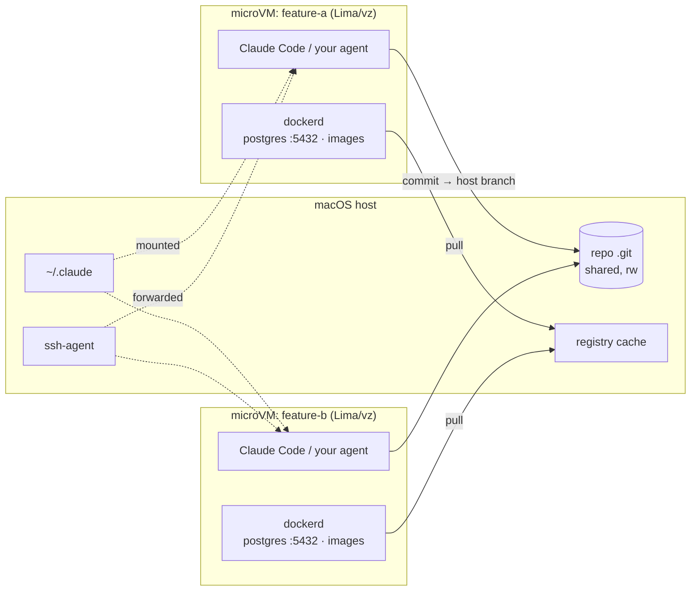

<div align="center">

# wtx

**git worktree ごとに、専用の microVM を。**

並列で走るコーディングエージェントが DB、ポート、Docker イメージを取り合わない。
それでいて、VM 内のコミットはそのままホストのブランチに乗る。

[](#ライセンス)
[](#動作環境)
[](Cargo.toml)
[](https://github.com/rakutek/wtx/actions/workflows/ci.yml)

[English](README.md) | 日本語

</div>

---

同じリポジトリの3ブランチで3つのコーディングエージェントを走らせると、全員が `localhost:5432` を取り合い、全員が同じデーモンへ `docker compose up` し、あるブランチのマイグレーションが別ブランチの検証中の DB を壊す。

wtx は git worktree ごとに専用の microVM（Lima/vz）と VM 内専用の dockerd を与える。
各ブランチが自分の DB、自分のポート、自分のイメージストアを持つ。
一方で git と `~/.claude` と ssh-agent はホストと共有したままにする。
VM 内のコミットはホストのブランチをそのまま動かし、VM 内から `git push` も `claude` もそのまま使える。
Docker Desktop は不要。

```text
 wtx   mirror[launchd]  ●docker.io  ●ghcr.io  ●quay.io  ●registry.k8s.io
    NAME                    STATUS        BRANCH          SIM         NOTE
┌ VMs ──────────────────────────────────────────────────────────────────────┐
│▶▾ hono-test  ~/dev/hono-test  [2/2 running]                               │
│   books-api               Running       books-api       sim:Booted        │
│   hono-dev                Running       main                              │
│ ▾ myapp  ~/repos/myapp  [1/2 running]                                     │
│   myapp-feature-a         ⠹ start 8s    feature-a                         │
│   myapp-feature-b         Stopped       feature-b                         │
│ ▾ (no project)  [0/1 running]                                             │
│   wtx-golden              Stopped                                         │
└───────────────────────────────────────────────────────────────────────────┘

 j/k:move  Enter:shell/fold  s:start/stop  d:delete  Space:fold  r:refresh  q:quit
```

## ハイライト

- ⚡ **新しい VM が約8秒**：`wtx up` はプロビジョニング済みのゴールデン VM を clone する（3〜4分が約8秒になる）
- 🌱 **環境ごと引き継ぐ**：`wtx up --from` は既存 VM を clone し、docker volume（DB データ）、pull 済みイメージ、導入済みツールを持ち越す
- 🔀 **回収の儀式なし**：ホストの `.git` を読み書きマウントする。VM 内のコミットは直接ホストのブランチに乗るので、VM を消しても作業が失われる経路がない
- 🤖 **エージェントがそのまま動く**：`~/.claude` はライブ共有、ssh-agent はフォワード。VM 内の Claude Code はホストの資格情報で動き、`git push` も通る
- 🔌 **オーケストレータ向け契約**：`wtx ensure --json` はversion付きready receipt、`wtx inspect --json` はruntime/owner状態を返し、`wtx exec --tty` は対話agent TUIをSSH越しに接続する
- 📦 **内蔵レジストリキャッシュ**：pull-through キャッシュを wtx 自身が実装（Docker 不要）。launchd がオンデマンド起動し、常駐プロセスなし
- 📱 **worktree 専用 iOS シミュレータ**：`wtx sim` が worktree ごとの専用デバイスを VM と対にし、UDID とポートを環境変数でエージェントに渡す
- 🖥️ **TUI コンソール**：全 VM をプロジェクトごとにまとめ、ミラーの稼働状況とともに1画面で操作する

> [!WARNING]
> **wtx は便利ツールであり、セキュリティサンドボックスではない。**
> VM で分かれているのは docker、ポート、プロセス空間であって、権限境界ではない。
> VM 内のプロセスはホストの `.git` や `~/.claude` に書けるし、ssh-agent も使える。
> 信頼できないコードやエージェントを閉じ込める用途には使わないこと。

## 動作環境

- Apple Silicon の macOS（vz、つまり Apple Virtualization.framework を使う）
- [Lima](https://lima-vm.io/)（Homebrew formula が自動でインストールする）
- ソースからビルドするための Rust ツールチェイン
- Xcode（`wtx sim` を使う場合のみ）

## インストール

```bash
brew install rakutek/tap/wtx
```

> [!NOTE]
> crates.io の `wtx` クレートは無関係の別プロジェクト。
> ソースからビルドする場合は、このリポジトリを clone して `cargo install --path .` を実行し、
> Lima は `brew install lima` で別途インストールする。

## クイックスタート

```bash
wtx image build       # 初回のみ: ゴールデンVMを構築（3〜4分）
wtx mirror install    # 任意: レジストリキャッシュ（launchdオンデマンド、常駐なし）

# ブランチごとにworktreeを切り、worktreeごとに1 VM。それぞれが自分のdockerd、DB、ポートを持つ
cd ~/repos/myapp
wtx new feature-a     # git worktree add ../myapp-feature-a とVM作成を一発で（約8秒）
wtx exec myapp-feature-a -w ~/repos/myapp-feature-a docker compose up -d --wait

# 2本目のworktreeは1本目のVMから引き継ぐ: DBデータ、イメージ、ツールが乗り移る
wtx new feature-b --from myapp-feature-a

wtx shell myapp-feature-a              # 中でclaudeが使える（設定と認証はホストと共有）
wtx rm myapp-feature-a --with-worktree # VMとlinked worktreeをまとめて片付ける
wtx ls                # VM一覧（worktree消失の孤児VMも表示。--json で機械可読）
wtx prune --yes       # 孤児VMを掃除
wtx                   # 引数なしでTUIコンソール
```

## 仕組み



- **microVM は Lima + vz**（Apple Virtualization.framework）。worktree ごとに専用 dockerd を持つための器であって、セキュリティ境界としては設計していない
- **同パスマウント**：virtiofs でホストと同じ絶対パスにマウントする。worktree をホスト側から直接編集する使い方はそのまま維持される
- **git はホストと共有**：worktree のメイン `.git` を読み書きマウントする。VM 内のコミットはホストのブランチをそのまま動かすので、回収の工程がなく、VM を消しても作業が失われる経路がない。worktree は各自独立した index/HEAD を持つため、複数 VM が同じリポジトリに同時コミットしても衝突しない（2 VM 同時コミットと fsck クリーンを実機検証済み）
- **`~/.claude` はマウント共有**：資格情報、settings.json、skills がホストとライブで一致し、VM 側でのトークンリフレッシュもホストとずれない。ホスト側パスを virtiofs でマウントし、ゲストの `~/.claude` から symlink を張る。無効化は `--no-claude`
- **ssh-agent フォワード**：鍵ファイルを VM に置かずに、VM 内から `git push` や `gh` がそのまま使える。ホスト側 agent に鍵が入っていることが前提
- **ゴールデン VM**：`wtx image build` で一度だけプロビジョニングし、以後の `wtx up` は `limactl clone` するだけ。VM 作成が3〜4分から約8秒になる（`--no-clone` で毎回プロビジョニング）
- **ポート**：Lima の自動フォワードは全無効化。複数 VM が各自の `localhost:5432` を同時に持てる。公開は `wtx forward`（ssh -L）、ホスト常駐サービスへの逆方向は `wtx bridge`（ssh -R）
- **VM 内ツール**：docker（rootful）、Node 22、Claude Code、git（identity はホスト設定から注入）

## 機能

### 既存環境からの引き継ぎ（`wtx up --from`）

`wtx up NAME DIR --from SRC` は、ゴールデン VM の代わりに既存 VM を clone する。
docker volume（DB データ込み）、pull 済みイメージ、導入済みツールがまるごと新 VM に乗る。
マイグレーション済みでデータ投入済みのメイン VM から、新しい worktree の VM を生やす使い方が典型になる。

clone 元は複製の間だけ停止して at-rest のディスクを写すので、稼働中コピーの不整合が起きない（実測ダウンタイム約11秒）。
その後はバックグラウンドで自動復帰する。
compose の volume 名は `<プロジェクト名>_` 接頭辞（既定はディレクトリ名）を持ち worktree ごとに変わるため、wtx が自動で新しい名前に付け替える。
compose ファイルで `name:` を固定していれば接頭辞は変わらず、そのまま使われる。
clone 元由来のコンテナは新 VM から除去される。

### 内蔵レジストリキャッシュ

pull-through キャッシュを wtx 自身が実装しているので、動かすのに Docker が要らない。
blob は digest で不変なのでディスクにキャッシュし、manifest は tag が動くので常に上流へ問い合わせる。
この分担により、キャッシュ不整合は構造的に起きない。
上流の 401 は `WWW-Authenticate` を解釈してトークンを取得するので、docker.io だけでなく ghcr.io や quay.io も同じ仕組みで配信できる。

`wtx mirror install` は **launchd ソケットアクティベーション**を登録する。
常駐プロセスはなく、pull が来た瞬間に起動して10分アイドルで終了する。
対象と待受ポートは `~/.wtx/mirrors.json` で変更できる。
ミラーが落ちていても上流直行にフォールバックする。
透過的に効くのは docker.io のみ（Docker 側の制約。[既知の制約](#既知の制約--todo)を参照）。

### worktree 専用 iOS シミュレータ（`wtx sim`）

シミュレータは VM に入らない（CoreSimulator はホストの Xcode に属する）。
そこで wtx はホスト側に worktree 専用デバイス `wtx-NAME` を作り、寿命だけを VM に連動させる。
`wtx up --sim` で作成、`rm` や `prune` で削除、`--from` ではアプリとデータごと clone される。

`wtx sim wire api:3000` で VM 内ポートをホストへ払い出す（42000〜、記録式）。
エージェントは worktree 内で `eval "$(wtx sim env)"` を実行し、`$WTX_SIM_UDID` と `$WTX_PORT_API` を使う。
NAME はどこでも省略可能で、カレントディレクトリから解決される（`wtx which` も同じ）。
tap などの操作は wtx には持たせず、`xcrun simctl` などに任せる。
設計と検証は [docs/DESIGN-sim.md](docs/DESIGN-sim.md) と VERIFICATION.md フェーズ9。

### TUI コンソール（`wtx` / `wtx tui`）

VM を**プロジェクト（ホスト側リポジトリ）ごとにまとめて**表示し、状態とミラーの稼働状況を1画面で見て操作する。
グループ化のキーは `wtx up` 時に記録したメインリポジトリのパス。
worktree を複数切っているプロジェクトはまとめて並び、リポジトリに紐づかない VM（ゴールデン VM など）は末尾に集まる。
見出し行で `Space`（または `Enter`、`←`、`→`）を押すと開閉し、`[稼働数/総数]` だけが残る。
`Enter` は VM 行では TUI を畳んで VM 内シェルに入り、抜けると復帰する。
`--snapshot` を付けると tty なしで1フレームだけ描画して終了する（動作確認用）。

start / stop / delete と状態ポーリングはバックグラウンドで走るので、UI は固まらない。
操作中の VM は STATUS 欄にスピナーと経過秒数を表示し、その間も他の行の操作や終了ができる。

CLI の出力、ヘルプ、TUI のラベルはすべて英語。

## なぜ既存の方法ではだめか

**素の `git worktree`** が分離するのはファイルであって、ランタイムではない。
どの worktree も一つの dockerd、一つのイメージストア、一つの `localhost:5432` を共有する。
並列エージェントが衝突するのは、まさにその資源である。

**1デーモン上で compose プロジェクトを手で分ける**方法もある。
worktree ごとに `COMPOSE_PROJECT_NAME` とポートのずらし幅を割り当てればよい。
しかしそれは共有デーモンの上に載せたブランチごとの帳簿であり、並列エージェントが既定値のまま `docker compose up` を打った瞬間に破られる。

**Docker Sandboxes（sbx）** の隔離技術は wtx と同じ（Apple Virtualization.framework の microVM）。
ただし評価した時点では、`sbx create` に Docker アカウントと Subscription Service Agreement への同意が必要だった。
また `--clone` はリポジトリを読み取り専用で渡し、`sandbox-<name>` リモート経由で作業を回収する方式だった。
wtx は OSS スタック（Lima）でアカウント不要、ホストの `.git` を直接共有するので回収の工程がない。
評価記録は [VERIFICATION.md](VERIFICATION.md) フェーズ1。

## コマンド一覧

| コマンド | 内容 |
|---|---|
| `wtx new BRANCH [--dir DIR]` | worktree と VM を一発で作成（ブランチが無ければ作る。`--from` や `--sim` も使える） |
| `wtx up [NAME] [DIR]` | 既存 worktree に VM を作成して起動。引数なしはカレントディレクトリから解決（ゴールデン VM を clone、約8秒） |
| `wtx up NAME DIR --from SRC` | 既存 VM から引き継いで作成（volume、イメージ、ツールが乗り移る） |
| `wtx ensure [NAME] [DIR] [--json]` | VMを冪等に作成・起動してdockerd readyまで待機。owner来歴も記録可 |
| `wtx inspect [NAME] [--json]` | VM/worktreeのready、seed、owner、port、Simulator状態を取得 |
| `wtx exec NAME [-w DIR] [--tty] CMD…` | VM 内でコマンド実行（終了コードは素通し、`--tty`で対話agent CLI対応） |
| `wtx shell NAME` | VM 内の対話シェル |
| `wtx ls [--json]` | VM 一覧（worktree 消失の孤児 VM も表示） |
| `wtx` / `wtx tui` | TUI コンソール（`--snapshot` で tty なし1フレーム描画） |
| `wtx forward NAME HOST:GUEST` | VM のポートをホストへ公開（ssh -L） |
| `wtx bridge NAME GUEST:HOST` | ホストのポートを VM 内へ届ける（ssh -R） |
| `wtx unforward NAME PORT` | forward / bridge の解除 |
| `wtx stop NAME` | VM を停止 |
| `wtx rm NAME [--with-worktree]` | VM を削除（linked worktree もまとめて削除可） |
| `wtx prune [--yes]` | worktree が消えた VM をまとめて削除 |
| `wtx image build\|rm\|status` | ゴールデン VM の管理 |
| `wtx mirror install\|uninstall\|up\|down\|status` | レジストリキャッシュの管理 |
| `wtx which` | カレント worktree の VM 名を表示（他コマンドと組み合わせ可） |
| `wtx completions SHELL` | シェル補完を出力（bash, zsh, fish など） |
| `wtx sim create\|status\|wire\|env\|rm` | worktree 専用 iOS シミュレータ |

## オーケストレータ（Orca 等）との連携方針

wtx は何にも依存しない。監督付きworkerでは、task/worktreeはオーケストレータ、runtimeだけをwtxが所有する。

```bash
wtx ensure worker-a /abs/worktree \
  --owner orca \
  --owner-label run_id=run_123 \
  --owner-label task_id=task_456 \
  --owner-label dispatch_id=dispatch_789 \
  --json
wtx inspect worker-a --json
wtx exec worker-a --tty -w /abs/worktree claude
```

`ensure` は、VMが無ければ作成、停止中なら起動、実行中なら再利用し、dockerd readyまで待つ。
既存VMに対する作成専用の`--from`は再cloneせず、記録済みseedと一致するか検証する。
JSON receiptは`schema_version: 1`を持つ。owner labelはcleanup・監査用の不透明なmetadataであり、
wtx自身はtask statusやdispatchを管理しない。
境界とreceipt schemaの詳細は[docs/DESIGN-orchestration.md](docs/DESIGN-orchestration.md)。

その他の連携点:

- Orca terminal から `wtx ensure` / `wtx exec` / `wtx shell` をそのまま呼べる（`wtx exec` の終了コードは素通し）
- worker 内からホストの runtime に届かせたいときは `wtx bridge NAME GUEST:HOST`
- 完了通知をファイルで受けるなら、共有マウント上に `.result/` を書く運用も可

エージェント用スキル（[skills/wtx/SKILL.md](skills/wtx/SKILL.md)）は次で導入できる。

```bash
npx skills add rakutek/wtx
```

## 実機検証

wtx の全メカニズムは、実 VM に対する検証を経て採用された。
採用しなかった方式とその失敗理由、途中で摘出したバグまで含めた記録が [VERIFICATION.md](VERIFICATION.md) にある。

主要フローは通しの検証スクリプトで再検証できる。

- `scripts/check-worktree-lifecycle.sh`：作成 → VM 内コミットのホスト直接反映 → 2 VM 同時コミット → 削除 → 孤児検出 → `prune` までを実 VM で通しで検証する（VM を2台作って消すので1〜2分）。既に孤児 VM があるときは、`prune` が既存 VM を巻き込む恐れがあるため中止する
- `scripts/check-seed.sh`：`wtx up --from` の引き継ぎ（volume 付け替え、compose での採用、共有 git の非干渉、clone 元の自動復帰）を実 VM で検証する
- `scripts/check-sim.sh`：`wtx sim` のデバイスライフサイクルを検証する

## 運用上の注意

- **worktree を消しても VM は残る**（git にフックがないため連動できない）。`wtx ls` と TUI はそうした VM を `orphaned` と表示し、`wtx prune --yes` でまとめて掃除できる。コミットはホストの `.git` に刻まれているので、VM を消しても作業は失われない。片付けを一度で済ませたいときは `wtx rm NAME --with-worktree`（linked worktree のときだけ畳む。通常リポジトリでは本体を消さないよう何もしない）
- **旧バージョンの wtx（隔離 git モード）で作った VM** は、VM 内コミットがホストに現れない。`wtx up` で再アタッチすると検知して警告するので、作り直すこと。旧バージョンが残した gc 保護 ref（`refs/wtx/keep/*`）は `wtx rm` がベストエフォートで片付ける
- launchd の plist には `wtx mirror install` を実行したときの実行パスが焼かれる。PATH 上のシンボリックリンク経由で実行すればそのパスが入るので移動に強いが、ビルド成果物を直接叩いて登録した場合は `cargo clean` や移動でミラーが起動しなくなる。その場合は `wtx mirror install` を再実行する。`~/.wtx/mirrors.json` を編集した場合もソケット一覧を作り直すため再実行が必要

## 既知の制約 / TODO

- **非 Docker Hub レジストリの透過キャッシュは不可（Docker 側の制約）**。Docker Engine 29 の `registry-mirrors` は Hub 専用で、containerd の `/etc/containerd/certs.d/<registry>/hosts.toml` を置いても、システム containerd に切り替えて transfer プラグインへ `config_path` を与えても、ghcr.io の pull はミラーに来ないことをアクセスログで確認済み（`wtx up` は certs.d を書くので、Docker 側が対応すれば自動で効く）。wtx のミラー自体は ghcr/quay でも正常に配信できるので、明示的に `docker pull localhost:5002/<org>/<image>` の形なら現時点でも利用できる
- ゴールデン VM には mirrors 設定と `ssh.forwardAgent` が焼き込まれる（`wtx up` 時に certs.d は再適用されるが、`daemon.json` の Hub ミラーポートを変えた場合や、旧ゴールデンのままで agent フォワードが効かない場合は `wtx image rm && wtx image build` で作り直す）
- `wtx exec` はシェル構文を解釈しない（argv 素通し）。パイプ等は `bash -c '...'` で渡す
- clone された VM（ゴールデン / `--from`）のディスクサイズは clone 元のまま（`--disk` は新規プロビジョニング時のみ有効）。`--memory` / `--cpus` は省略すると clone 元の値を引き継ぐ
- `--from` の volume 付け替えは `<ディレクトリ名>_` 接頭辞の一致で判定する。`COMPOSE_PROJECT_NAME` 環境変数など wtx から見えない方法でプロジェクト名を変えている場合は付け替わらない（`docker volume` を手で rename する）
- VM 内からの `git push` はホストの ssh-agent に鍵が入っているときだけ通る（macOS は `ssh-add --apple-use-keychain` などで agent に鍵を載せておく）
- ミラーのキャッシュ削除（GC）は未実装。`~/.wtx/mirror-cache` を手動で消す

## ドキュメントの言語

CLI の出力、ヘルプ、TUI のラベルはすべて英語。
README は英語版（[README.md](README.md)）がメインで、このページはその日本語版。
[VERIFICATION.md](VERIFICATION.md) と [docs/DESIGN-sim.md](docs/DESIGN-sim.md)、コード中のコメントは日本語。

## ライセンス

以下のいずれかのライセンスを選択して利用できる（デュアルライセンス）。

- Apache License, Version 2.0（[LICENSE-APACHE](LICENSE-APACHE) または http://www.apache.org/licenses/LICENSE-2.0）
- MIT License（[LICENSE-MIT](LICENSE-MIT) または http://opensource.org/licenses/MIT）

特に明示しない限り、このリポジトリへ意図的に提出されたコントリビューションは（Apache-2.0 ライセンスの定義に従い）追加の条件なく上記のデュアルライセンスで提供されたものとみなす。
