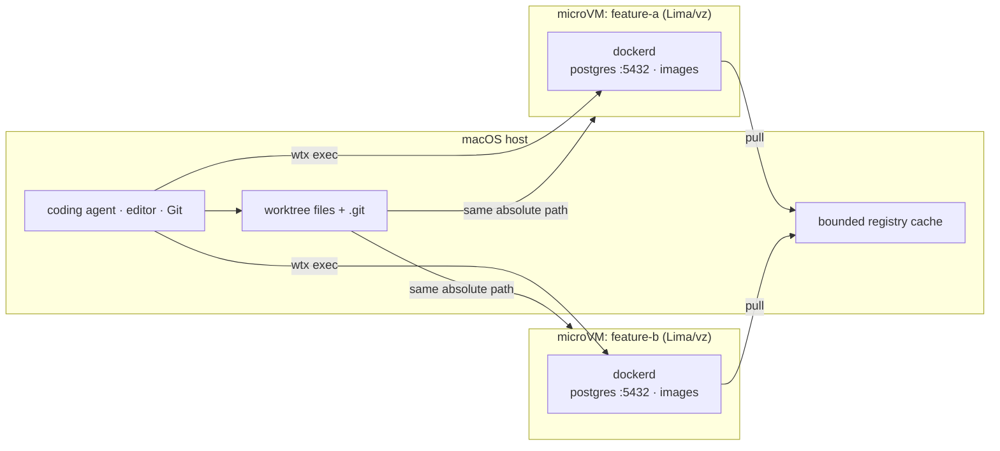

<div align="center">

# wtx

**The same localhost, a different runtime, for every worktree.**

Give parallel coding agents an unchanged `localhost:5432` and a cloneable DB/runtime per
worktree, without adding wtx-specific configuration to the project.

[](#license)
[](#requirements)
[](Cargo.toml)
[](https://github.com/rakutek/wtx/actions/workflows/ci.yml)

English | [日本語](README.ja.md)

</div>

---

Running three coding agents on three branches of the same repo sounds great — until they all
bind `localhost:5432`, all run `docker compose up` against the same daemon, and one branch's
migration wrecks the database another branch was testing against.

`wtx` gives each git worktree its own microVM (Lima/vz) with a dedicated in-VM dockerd.
Each branch gets the same familiar localhost ports, but a different database, volume, and
image store. Agents, editing, Git, and credentials stay on the host; only Docker, databases,
services, and container-dependent tests go through `wtx exec`. No Docker Desktop.

```text
 wtx   mirror[launchd]  ●docker.io
    NAME                    STATUS        BRANCH          SIM         NOTE
┌ VMs ──────────────────────────────────────────────────────────────────────┐
│▶▾ hono-test  ~/dev/hono-test  [2/2 running]                               │
│   books-api               Running       books-api       sim:Booted        │
│   hono-dev                Running       main                              │
│ ▾ myapp  ~/repos/myapp  [1/2 running]                                     │
│   myapp-feature-a         ⠹ start 8s    feature-a                         │
│   myapp-feature-b         Stopped       feature-b                         │
│ ▾ (no project)  [0/1 running]                                             │
│   wtx-golden              Stopped                                         │
└───────────────────────────────────────────────────────────────────────────┘

 j/k:move  Enter:shell/fold  s:start/stop  d:delete  Space:fold  r:refresh  q:quit
```

## Highlights

- ⚡ **A new VM in ~8 seconds** — `wtx up` clones a pre-provisioned golden VM instead of
  provisioning from scratch (3–4 minutes → ~8 seconds)
- 🌱 **Seed one environment from another** — `wtx up --from` clones an existing VM, carrying
  over docker volumes (your DB data), pulled images, and installed tools
- 🏠 **No project-specific port scheme** — every worktree can keep using its normal
  `localhost:5432`; agents do not need branch-specific port offsets or prompts
- 🔀 **No sync ritual** — the host `.git` is mounted read-write. Commits inside the VM land
  on the host branch directly, so deleting a VM cannot lose committed work
- 🔌 **Orchestrator-ready contract** — `wtx ensure --json` returns a versioned readiness
  receipt, and `wtx inspect --json` reports runtime/owner state
- 📦 **Built-in registry cache** — a pull-through cache implemented in wtx itself
  (no Docker required), streamed with Range support and bounded by automatic GC
- 📱 **Per-worktree iOS simulators** — `wtx sim` pairs a dedicated simulator device with
  each worktree's VM and hands agents its UDID and ports as env vars
- 🖥️ **A TUI console** — one screen for every VM, grouped by project, plus mirror health
- ⬆️ **Quiet update checks** — explicit with `wtx update check`; the interactive TUI uses a
  24-hour cache and never turns ordinary commands into network calls

> [!WARNING]
> **wtx isolates runtime collisions, not trust.** The worktree and `.git` are writable host
> mounts, so code in the VM can change host-visible source and Git metadata. Keep agents and
> credentials on the host, and never use wtx to contain untrusted code. `--agent-access`
> explicitly shares `~/.claude` and the ssh-agent for trusted, VM-resident agents only.

The exact boundary and credential behavior are documented in
[docs/TRUST-MODEL.md](docs/TRUST-MODEL.md).

## Requirements

- macOS on Apple Silicon (wtx uses vz, the Apple Virtualization.framework backend)
- [Lima](https://lima-vm.io/) (installed automatically by the Homebrew formula)
- A Rust toolchain, to build from source
- Xcode, only if you use `wtx sim`

## Install

```bash
brew install rakutek/tap/wtx
```

> [!NOTE]
> The `wtx` crate on crates.io is an unrelated project. To build from source, clone this
> repository and run `cargo install --path .`; install Lima separately with `brew install lima`.

## Quick start

```bash
wtx image build       # one-time: build the golden VM (3–4 min)
wtx mirror install    # optional: registry cache (launchd on-demand, no daemon)

# a worktree per branch, a VM per worktree — each with its own dockerd, DBs, and ports
cd ~/repos/myapp
wtx new feature-a     # git worktree add ../myapp-feature-a + its VM, in one step (~8 s)
cd ../myapp-feature-a
wtx exec -- docker compose up -d --wait
wtx forward 8080:3000 # publish VM port 3000 at host localhost:8080

# a second worktree, seeded from the first: DB data, images, and tools carry over
cd ~/repos/myapp
wtx new feature-b --from myapp-feature-a

wtx rm myapp-feature-a --with-worktree # tear down the VM and its linked worktree together
wtx ls                # lists VMs, flags orphans whose worktree is gone (--json for scripts)
wtx prune --yes       # clean up orphaned VMs
wtx                   # no args: the TUI console
```

## How it works



- **microVMs via Lima + vz** (Apple Virtualization.framework). The VM exists to give each
  worktree a private dockerd — it is deliberately not designed as a security boundary.
- **Same-path mounts** — virtiofs mounts the worktree at the same absolute path as on the
  host, so editing files from the host keeps working as before.
- **Git is shared with the host** — the worktree's main `.git` is mounted read-write.
  A commit inside the VM moves the host branch directly: there is no "collect the work"
  step, and no path by which deleting a VM loses committed work. Worktrees keep independent
  index/HEAD, so multiple VMs can commit to the same repository concurrently
  (verified on real VMs: two simultaneous commits, `git fsck` clean).
- **Credentials stay on the host by default** — `~/.claude` is not mounted and ssh-agent
  forwarding is disabled. `--agent-access` opts into both at creation for trusted VM-resident
  agents. This mount policy is immutable, so changing it requires recreating the VM; it does not
  turn wtx into a security sandbox.
- **Golden VM** — `wtx image build` provisions once; after that `wtx up` is just a
  `limactl clone`, taking VM creation from 3–4 minutes to ~8 seconds. The default command
  refuses a missing/stale golden image instead of silently creating a different environment;
  `--no-clone` is the explicit fresh-provisioning escape hatch.
- **Ports** — Lima's automatic port forwarding is disabled entirely, so several VMs can
  each hold their own `localhost:5432` at the same time. Publish a VM port to the host
  with `wtx forward` (ssh -L); reach a host-resident service from inside the VM with
  `wtx bridge` (ssh -R).
- **Pinned in-VM runtime** — rootful Docker Engine and its plugins are version-pinned.
  Agent-specific CLIs are not globally installed. Git identity is safely re-applied from the
  host after every fresh start or clone, rather than being frozen into the golden image.

### Resource cost

Each VM is configured with **4 GiB RAM, 2 CPUs, and a 20 GiB disk by default**. Clones keep
the source disk and inherit CPU/RAM unless overridden. This is intentionally heavier than
Compose project names: use plain worktrees or one shared daemon when branch-specific runtime
state and unchanged localhost assumptions are not worth that cost.

## Features

### Seed a new environment from an existing one (`wtx up --from`)

`wtx up NAME DIR --from SRC` clones an existing VM instead of the golden image: docker
volumes (DB data included), pulled images, and installed tools all carry over. The typical
use is growing a new worktree's VM out of your migrated, data-loaded main VM.

The source VM is stopped only while its disk is copied at rest (about 11 seconds measured,
so a running-copy inconsistency cannot occur), then restarts automatically in the
background. Compose volume names carry a `<project-name>_` prefix (the directory name by
default), which changes per worktree — wtx re-prefixes the cloned volumes to the new name
automatically. If your compose file pins a project `name:`, the prefix does not change and
the volumes are used as-is. Containers inherited from the source are removed from the new VM.

### Built-in registry cache

A pull-through cache implemented in wtx itself — no Docker needed to run it. Blob hits and
misses stream without loading whole layers into memory; HEAD and Range requests are honored,
and a blob is cached only after its SHA-256 digest verifies. Manifests move with tags, so they
are always fetched upstream. Bearer tokens are cached by registry/repository scope rather
than in one global slot.

`wtx mirror install` registers **launchd socket activation**: no resident process — the
cache starts the moment a pull arrives and exits after 10 idle minutes. The default setup
starts only the Docker Hub endpoint because Docker Engine only applies `registry-mirrors`
there. Extra registries can be added to `~/.wtx/mirrors.json` for explicit localhost pulls.
The cache is capped at 20 GiB by default and evicts oldest blobs after writes; run
`wtx mirror gc --max-gib N` to change the persistent limit and collect immediately.

### Per-worktree iOS simulators (`wtx sim`)

Simulators cannot live inside the VM (CoreSimulator belongs to the host's Xcode), so wtx
creates a dedicated host-side device `wtx-NAME` per worktree and ties only its lifecycle
to the VM: created by `wtx up --sim`, removed by `rm`/`prune`, and cloned — apps and data
included — by `--from`.

`wtx sim wire api:3000` allocates a host port (42000+, recorded) for a VM port. Agents run
`eval "$(wtx sim env)"` inside the worktree and use `$WTX_SIM_UDID` / `$WTX_PORT_API`.
`NAME` can be omitted everywhere — it resolves from the current directory (`wtx which`
does the same). Before invoking an external tool, an agent resolves `sim_udid` with
`wtx sim env --json` and explicitly binds that UDID, or a verified worktree-scoped
session/window, without falling back to the first, booted, active, or focused device.
wtx deliberately ships no tap/UI automation or tool-specific adapters. Design notes:
[docs/DESIGN-sim.md](docs/DESIGN-sim.md)
(Japanese) and VERIFICATION.md Phase 9.

### TUI console (`wtx` / `wtx tui`)

VMs are grouped **per project** (the main repository recorded at `wtx up` time), with VM
state and mirror health on one screen. Projects with several worktrees stay together;
VMs not tied to a repository (such as the golden VM) collect at the bottom. `Space`
(or `Enter` / `←` / `→`) on a heading folds a group down to its `[running/total]` count.
`Enter` on a VM row suspends the TUI, drops you into a shell in that VM, and restores the
TUI when you exit. `--snapshot` renders a single frame without a tty and exits (for smoke
tests).

start / stop / delete and state polling run in the background, so the UI never blocks —
the affected VM shows a spinner with elapsed seconds in its STATUS cell, and you can keep
navigating (or quit) while an operation is in flight.

The interactive TUI also checks GitHub Releases in the background at most once every 24
hours and shows `brew upgrade wtx` only when a newer stable release exists. Failures stay
silent. `wtx tui --snapshot` never checks or displays update notices.

The CLI and TUI are fully English — output, help, and labels.

### Update checks

Run `wtx update check` for an explicit check, or add `--json` for a versioned machine-readable
result. Ordinary commands never perform an update request. Set `WTX_NO_UPDATE_CHECK=1` to
disable the TUI's background check. wtx does not self-update; Homebrew remains responsible
for installation and upgrades:

```bash
wtx update check --json
brew upgrade wtx
```

## Why not …?

**Plain `git worktree`** isolates your files, not your runtime. Every worktree still shares
one dockerd, one image store, and one `localhost:5432` — exactly the resources parallel
agents collide on.

**Hand-managed compose projects on one daemon** can work: assign each worktree a
`COMPOSE_PROJECT_NAME` and a port offset. But that is per-branch bookkeeping layered on a
single shared daemon — the kind of convention a parallel agent breaks the first time it
runs `docker compose up` with defaults. Prefer that lighter option when changing project
configuration and agent instructions is acceptable.

**Dev Containers** standardize a development container and are often the better choice for
one active workspace. They normally share the host's Docker daemon/runtime state and still
need per-worktree naming and port policy for parallel default commands. wtx instead clones an
entire dockerd state, including seeded database volumes, while leaving editing on the host.

**Docker Sandboxes (sbx)** builds on the same isolation technology (Apple
Virtualization.framework microVMs). When we evaluated it, `sbx create` required Docker
authentication (an account plus agreement to the Subscription Service Agreement), and its
`--clone` flow provides the repo read-only, collecting work through a `sandbox-<name>`
remote. wtx is an OSS stack (Lima) with no account, and shares the host `.git` directly —
there is no collection step. The evaluation notes are in
[VERIFICATION.md](VERIFICATION.md) (Japanese), Phase 1.

## Command reference

| Command | What it does |
|---|---|
| `wtx new BRANCH [--dir DIR]` | Create a git worktree and its VM in one step (the branch is created if missing; `--from`, `--sim` etc. apply) |
| `wtx up [NAME] [DIR]` | Create/start a VM for an existing worktree; with no args, resolves from the current directory (clones the golden VM, ~8 s) |
| `wtx up NAME DIR --from SRC` | Seed from an existing VM: volumes, images, tools carry over |
| `wtx ensure [NAME] [DIR] [--json]` | Idempotently create/start a VM and wait for dockerd; optionally record owner provenance |
| `wtx inspect [NAME] [--json]` | Report VM/worktree readiness, seed, owner, ports, and simulator state |
| `wtx exec [--name NAME] [-w DIR] [--tty] -- CMD…` | Run in the cwd-resolved VM; cwd is also the default guest directory. Legacy `NAME CMD…` remains accepted |
| `wtx shell [NAME]` | Interactive shell; NAME resolves from cwd when omitted |
| `wtx ls [--json]` | List VMs; flags orphans whose worktree is gone |
| `wtx` / `wtx tui` | TUI console (`--snapshot` for a single ttyless frame) |
| `wtx forward [--name NAME] HOST:GUEST` | Publish a VM port on the host (ssh -L) |
| `wtx bridge [--name NAME] HOST:GUEST` | Expose host HOST at guest GUEST (ssh -R); same argument order as `forward` |
| `wtx unforward [--name NAME] PORT` | Tear down a forward/bridge |
| `wtx stop [NAME]` | Stop a VM and its booted worktree Simulator |
| `wtx rm NAME [--if-exists] [--json] [--with-worktree]` | Delete a VM with an idempotent cleanup receipt or optional linked-worktree removal |
| `wtx prune [--yes]` | Delete VMs whose worktree no longer exists |
| `wtx image build\|rm\|status` | Manage the golden VM |
| `wtx mirror install\|uninstall\|up\|down\|status\|gc` | Manage the bounded registry cache |
| `wtx which` | Print the VM name for the current worktree (composable) |
| `wtx completions SHELL` | Print shell completions (bash, zsh, fish, elvish, powershell) |
| `wtx sim up\|status\|wire\|env\|rm` | Per-worktree iOS simulator |
| `wtx update check [--json]` | Check GitHub Releases for a newer version without installing it |

## Working with orchestrators and agents

wtx depends on nothing; everything goes through generic interfaces. For a supervised
worker, let the orchestrator own tasks/worktrees and let wtx own only runtime state:

```bash
wtx ensure worker-a /abs/worktree \
  --owner orca \
  --json
wtx inspect worker-a --json
wtx exec --name worker-a -w /abs/worktree -- docker compose up -d --wait
```

`ensure` is idempotent: it creates a missing VM, starts a stopped VM, or reuses a running
one, then waits for dockerd. Creation-only `--from` is checked against recorded provenance
on an existing VM rather than cloning again. JSON receipts carry `schema_version: 1`.
Owner metadata records cleanup/audit provenance; wtx does not own task status or dispatch.
The stable boundary and receipt schema are documented in
[docs/DESIGN-orchestration.md](docs/DESIGN-orchestration.md) (Japanese).

For Orca and Herdr, wait for `ensure` to succeed after worktree creation and before agent
startup. During cleanup, run `wtx rm NAME --if-exists --json` first and remove the
orchestrator-owned worktree only after it succeeds. Keep agents, edits, and Git on the host;
send Docker, databases, services, and container-dependent tests through `wtx exec`. Use
ordinary Docker Compose inside the VM and never silently fall back to host Docker.

Additional integration points:

- Call `wtx ensure` / `wtx exec` / `wtx shell` from any terminal-driving orchestrator
  (Orca, for example) — `wtx exec` passes exit codes through untouched
- Reach host port 9000 at guest port 9001 with `wtx bridge --name NAME 9000:9001`
- For file-based completion signals, write a `.result/` directory on the shared mount

An agent skill ([skills/wtx/SKILL.md](skills/wtx/SKILL.md)) installs with:

```bash
npx skills add rakutek/wtx
```

On a fresh worktree, the skill prefers the repository's documented setup and only uses its
bundled fallback to create a missing `.env` from `.env.example`. It never overwrites an
existing `.env`, copies one from another worktree, guesses secrets, or persists dynamic
`WTX_*` values, so repositories need no wtx-specific environment configuration.

## Verified on real VMs

Every mechanism in wtx was verified against real VMs before shipping — including the
approaches that did **not** work, and why. [VERIFICATION.md](VERIFICATION.md) (Japanese)
is the full lab notebook: rejected designs, failure modes, and the bugs found along the way.

End-to-end check scripts re-verify the core flows:

- `scripts/check-worktree-lifecycle.sh` — create → in-VM commit lands on the host →
  two VMs committing concurrently → delete → orphan detection → `prune`, all on real VMs
  (spins up and removes two VMs; takes 1–2 minutes). It aborts if orphaned VMs already
  exist, so that `prune` cannot sweep up VMs it did not create.
- `scripts/check-seed.sh` — `wtx up --from` seeding: volume re-prefixing, compose adoption,
  shared-git non-interference, and automatic restart of the clone source.
- `scripts/check-sim.sh` — the `wtx sim` device lifecycle.

## Operations notes

- **Deleting a worktree does not delete its VM** (git offers no hook wtx could attach to).
  `wtx ls` and the TUI flag such VMs as `orphaned`, and `wtx prune --yes` cleans them up.
  Commits are recorded in the host `.git`, so deleting the VM loses no work either way.
  To clean up in one move: `wtx rm NAME --with-worktree` — it folds linked worktrees only,
  and deliberately does nothing when the directory is a normal repository.
- **VMs created by old wtx versions (isolated-git mode)** do not propagate commits to the
  host. Re-attaching with `wtx up` detects this and warns — recreate the VM. Leftover
  gc-protection refs from old versions (`refs/wtx/keep/*`) are cleaned up best-effort by
  `wtx rm`.
- The launchd plist records the executable path in effect when you ran
  `wtx mirror install`. Invoking it via a PATH symlink keeps the registration robust
  against moves; if you registered a build artifact directly, `cargo clean` or moving the
  binary breaks mirror activation — re-run `wtx mirror install`. Re-run it as well after
  editing `~/.wtx/mirrors.json`, since the socket list must be regenerated.

## Known limitations / TODO

- **Transparent caching works for Docker Hub only (a Docker-side limitation).**
  Docker Engine 29's `registry-mirrors` applies to Hub alone. Placing containerd
  `/etc/containerd/certs.d/<registry>/hosts.toml` — or switching to the system containerd
  and giving the transfer plugin a `config_path` — still does not route ghcr.io pulls
  through the mirror, as confirmed in the mirror's access logs. wtx therefore configures
  only Docker Hub by default and does not write ineffective certs.d entries. Explicitly
  configured endpoints still support pulls of the form
  `docker pull localhost:5002/<org>/<image>`.
- VMs created before credential sharing became opt-in may still contain the old `~/.claude`
  mount and agent-forwarding setting. Recreate them; mount policy cannot be safely changed
  on reattachment.
- `wtx exec` does not interpret shell syntax (argv passes through verbatim). Wrap pipes
  and friends in `bash -c '...'`.
- Cloned VMs (golden or `--from`) keep the clone source's disk size — `--disk` applies to
  fresh provisioning only. `--memory` / `--cpus` inherit the source's values unless set.
- `--from` volume re-prefixing matches on the `<directory-name>_` prefix. If the project
  name is set in a way wtx cannot see (such as a `COMPOSE_PROJECT_NAME` environment
  variable), volumes are not re-prefixed — rename them manually with `docker volume`.
- With explicit `--agent-access`, `git push` from inside a VM works only while the host
  ssh-agent holds your key (on macOS, load it with `ssh-add --apple-use-keychain` or similar).

## Documentation languages

The CLI, help text, and TUI are English. This README has a Japanese edition at
[README.ja.md](README.ja.md). [VERIFICATION.md](VERIFICATION.md) and
[docs/DESIGN-sim.md](docs/DESIGN-sim.md) are currently Japanese, as are code comments.

## License

Licensed under either of

- Apache License, Version 2.0 ([LICENSE-APACHE](LICENSE-APACHE) or http://www.apache.org/licenses/LICENSE-2.0)
- MIT License ([LICENSE-MIT](LICENSE-MIT) or http://opensource.org/licenses/MIT)

at your option.

Unless you explicitly state otherwise, any contribution intentionally submitted for
inclusion in this work by you, as defined in the Apache-2.0 license, shall be dual-licensed
as above, without any additional terms or conditions.
