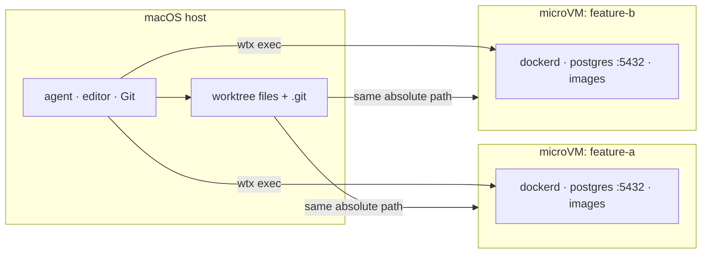

<div align="center">

# wtx

**The same localhost, a different runtime, for every worktree.**

Give parallel coding agents an unchanged `localhost:5432` and a cloneable DB/runtime per
worktree, without adding wtx-specific configuration to the project.

[](#license)
[](#requirements)
[](Cargo.toml)
[](https://github.com/rakutek/wtx/actions/workflows/ci.yml)

English | [日本語](README.ja.md)

</div>

---

Parallel agents on separate branches still collide when they share one Docker daemon, one
database, and one `localhost:5432`. wtx (**Worktree X**) gives every git worktree a dedicated
Lima/vz microVM with its own dockerd, volumes, images, and localhost namespace.

Agents, editors, Git, and credentials stay on the macOS host. Docker, databases, services,
and container-dependent tests run through `wtx exec`. Docker Desktop is not required.

```text
 wtx   mirror[launchd]  ●docker.io
    NAME                    STATUS        BRANCH          SIM         NOTE
┌ VMs ──────────────────────────────────────────────────────────────────────┐
│▶▾ hono-test  ~/dev/hono-test  [2/2 running]                               │
│   books-api               Running       books-api       sim:Booted        │
│   hono-dev                Running       main                              │
│ ▾ myapp  ~/repos/myapp  [1/2 running]                                     │
│   myapp-feature-a         ⠹ start 8s    feature-a                         │
│   myapp-feature-b         Stopped       feature-b                         │
│ ▾ (no project)  [0/1 running]                                             │
│   wtx-golden              Stopped                                         │
└───────────────────────────────────────────────────────────────────────────┘

 j/k:move  Enter:shell/fold  s:start/stop  d:delete  Space:fold  r:refresh  q:quit
```

## Highlights

- **A new VM in about 8 seconds:** clone a pre-provisioned golden VM instead of waiting
  3–4 minutes for fresh provisioning.
- **Clone the useful state:** `wtx up --from` carries database volumes, images, installed
  tools, and optionally simulator data into a new worktree.
- **Keep normal ports:** every worktree can use its usual `localhost:5432`; no branch-specific
  port offsets or project configuration are needed.
- **Share Git directly:** commits made in a VM land on the host branch, with no collection or
  sync step.
- **Automate through stable commands:** `ensure --json` and `inspect --json` expose
  versioned readiness and ownership data.
- **Optional batteries included:** a bounded registry cache, per-worktree iOS simulators, a
  project-grouped TUI, and one-command Homebrew upgrades.

> [!WARNING]
> **wtx isolates runtime collisions, not trust.** Worktree files and `.git` are writable host
> mounts, so VM code can change host-visible source and Git metadata. Keep agents and
> credentials on the host, and do not use wtx to contain untrusted code. `--agent-access`
> explicitly shares credentials with trusted VM-resident agents.

See the [trust model](docs/TRUST-MODEL.md) for the exact boundary.

## Requirements

- macOS on Apple Silicon
- [Lima](https://lima-vm.io/) (installed by the Homebrew formula)
- Xcode only when using `wtx sim`
- A Rust toolchain only when building from source

## Install

```bash
brew install rakutek/tap/wtx
```

> [!NOTE]
> The `wtx` crate on crates.io is unrelated. To build this project from source, clone the
> repository, install Lima separately, and run `cargo install --path .`.

## Quick start

```bash
wtx image build       # one-time: build the golden VM (3–4 min)

cd ~/repos/myapp
wtx new feature-a     # create a worktree and its VM (~8 s)
cd ../myapp-feature-a
wtx exec -- docker compose up -d --wait
wtx forward 8080:3000 # host localhost:8080 -> VM port 3000

cd ~/repos/myapp
wtx new feature-b --from myapp-feature-a # carry over DB data, images, and tools

wtx rm myapp-feature-a --with-worktree    # remove the VM and linked worktree
wtx                                      # open the TUI
```

## How it works



- The golden VM is provisioned once; `wtx up` uses `limactl clone` for later environments.
- virtiofs mounts each worktree at the same absolute path as the host, including writable Git
  metadata.
- Lima automatic port forwarding is disabled. Use `wtx forward` to publish a VM service and
  `wtx bridge` to expose a host service inside a VM.
- Each VM defaults to 4 GiB RAM, 2 CPUs, and a 20 GiB disk. If full runtime isolation is not
  worth that cost, use plain worktrees or Compose project names instead.

The [feature guide](docs/FEATURES.md) covers seeding, networking, the registry cache,
simulators, the TUI, and updates in detail.

## Common commands

| Command | Purpose |
|---|---|
| `wtx new BRANCH` | Create a worktree and VM together |
| `wtx up [NAME] [DIR]` | Create or start a VM for an existing worktree |
| `wtx exec -- CMD…` | Run a command in the current worktree's VM |
| `wtx shell [NAME]` | Open a VM shell |
| `wtx ls` | List VMs and flag orphaned ones |
| `wtx forward HOST:GUEST` | Publish a VM port on the host |
| `wtx stop [NAME]` / `wtx rm NAME` | Stop or remove a VM |
| `wtx prune --yes` | Remove VMs whose worktrees are gone |
| `wtx` | Open the TUI |

See the [complete command reference](docs/CLI.md) or run `wtx --help`.

## Agents and orchestrators

Let the orchestrator own tasks and worktrees; let wtx own only runtime state:

```bash
wtx ensure worker-a /abs/worktree --owner orca --json
wtx inspect worker-a --json
wtx exec --name worker-a -w /abs/worktree -- docker compose up -d --wait
```

The readiness schema and cleanup order are documented in the
[orchestrator contract](docs/DESIGN-orchestration.md). The bundled
[agent skill](skills/wtx/SKILL.md) can be installed with `npx skills add rakutek/wtx`.

## Documentation

- [Feature guide](docs/FEATURES.md): runtime behavior, seeding, mirror, simulator, TUI, updates
- [Command reference](docs/CLI.md): all commands and automation notes
- [Operations and limitations](docs/OPERATIONS.md): sizing, cleanup, caveats, E2E checks
- [Trust model](docs/TRUST-MODEL.md): mounts and credential boundary
- [Orchestrator contract](docs/DESIGN-orchestration.md): readiness and ownership schema
- [Simulator design](docs/DESIGN-sim.md): device and port assignment
- [Verification notebook](VERIFICATION.md): real-VM experiments and rejected designs

The CLI, help text, and TUI are English. This README also has a
[Japanese edition](README.ja.md); some design and verification documents are Japanese.

## License

Licensed under either:

- Apache License, Version 2.0 ([LICENSE-APACHE](LICENSE-APACHE))
- MIT License ([LICENSE-MIT](LICENSE-MIT))

at your option. Contributions intentionally submitted for inclusion are dual-licensed under
the same terms unless explicitly stated otherwise.
