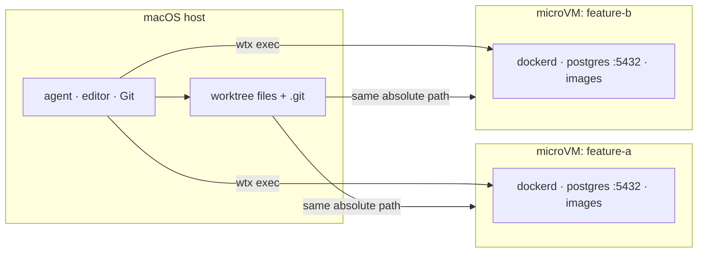

<div align="center">

# wtx

**The same localhost, a different runtime, for every worktree.**

Run many branches in parallel on the same machine without port conflicts, without project-specific
setup, and without giving up the normal localhost workflow.

[](#license)
[](#requirements)
[](Cargo.toml)
[](https://github.com/rakutek/wtx/actions/workflows/ci.yml)

English | [日本語](README.ja.md)

</div>

---

Many teams already split work into many branches, but parallel agents still hit the same shared runtime:
database ports collide, caches conflict, and service state leaks between branches.  
**wtx** solves this with per-worktree virtual machines while keeping your host git workflow intact.

With wtx, each worktree gets a dedicated Lima/vz microVM that has its own `dockerd`, volumes,
images, and localhost namespace so parallel work stays fast and isolated without daily manual cleanup.

Your agents, editors, Git repos, and credentials stay on macOS. Container services and tests run in
the VM through `wtx exec`, and Docker Desktop is not required.

```text
 wtx   mirror[launchd]  ●docker.io
    NAME                    STATUS        BRANCH          SIM         NOTE
┌ VMs ──────────────────────────────────────────────────────────────────────┐
│▶▾ hono-test  ~/dev/hono-test  [2/2 running]                               │
│   books-api               Running       books-api       sim:Booted        │
│   hono-dev                Running       main                              │
│ ▾ myapp  ~/repos/myapp  [1/2 running]                                     │
│   myapp-feature-a         ⠹ starting    feature-a                         │
│   myapp-feature-b         Stopped       feature-b                         │
│ ▾ (no project)  [0/1 running]                                             │
│   wtx-golden              Stopped                                         │
└───────────────────────────────────────────────────────────────────────────┘

 j/k:move  Enter:shell/fold  s:start/stop  d:delete  Space:fold  r:refresh  q:quit
```

## Why wtx

- **Keep branch switching cheap**: create or remove workspaces as part of your Git flow without rebuilding full stacks.
- **Avoid localhost wars**: every VM has its own loopback and services, while the host still uses normal host tools.
- **Run real-world parallelism**: separate runtime state means no branch-to-branch interference for CI-like checks.
- **Cloneability by default**: bootstrap new branches from a seeded baseline instead of repeating heavy setup.
- **Predictable collaboration**: orchestrator-friendly metadata and JSON APIs make machine-run automation stable.

## Highlights

- **Ready-to-use VMs:** clone a pre-provisioned golden VM (`wtx new`, `wtx up --from`) and start
  testing immediately.
- **Stateful cloning:** copy database volumes, images, installed tools, and optional simulator data between
  worktrees.
- **Zero port gymnastics:** keep `localhost:5432` available in each worktree without manual per-branch
  port remapping.
- **Native git workflow:** edits stay in the same files and `.git` directory on the host; no extra sync layer is required.
- **Automation-first:** machine-readable `ensure --json` and `inspect --json` for orchestrators and dashboards.
- **Built-in extras:** bounded image registry cache, per-worktree simulators, project-grouped TUI, and one-command updates.

> [!WARNING]
> **wtx isolates runtime collisions, not trust.** Worktree files and `.git` are writable host
> mounts, so VM code can change host-visible source and Git metadata. Keep agents and
> credentials on the host, and do not use wtx to contain untrusted code. `--agent-access`
> explicitly shares credentials with trusted VM-resident agents.

See the [trust model](docs/TRUST-MODEL.md) for the exact boundary.

## Requirements

- macOS on Apple Silicon
- [Lima](https://lima-vm.io/) (installed by the Homebrew formula)
- Xcode only when using `wtx sim`
- A Rust toolchain only when building from source

## Install

```bash
brew install rakutek/tap/wtx
```

> [!NOTE]
> The `wtx` crate on crates.io is unrelated. To build this project from source, clone the
> repository, install Lima separately, and run `cargo install --path .`.

## Quick start

1. Start from a branch and create an isolated worktree+VM.
2. Start required services in that VM with your usual compose command.
3. Export and use mapped host ports for local access.
4. Repeat for another branch without disrupting the first environment.

```bash
cd ~/repos/myapp
wtx new feature-a     # create a worktree and VM; first use prepares the shared base VM
cd ../myapp-feature-a
wtx exec -- docker compose up -d --wait
wtx port add web:3000 # allocate a collision-free host port for VM port 3000
eval "$(wtx env)"     # exports WTX_PORT_WEB and re-arms the forward when needed

cd ~/repos/myapp
wtx new feature-b --from myapp-feature-a # carry over DB data, images, and tools

wtx rm myapp-feature-a --with-worktree    # remove the VM and linked worktree
wtx                                      # open the TUI
```

## Who is this for?

- **Parallel feature devs**: multiple people or agents testing variants against one repo with fewer surprises.
- **Onboarding teams**: new engineers can boot consistent branches quickly from a known-good base VM.
- **Automation operators**: orchestrators can create and clean deterministic worker environments from CI-style tasks.

## Command flow at a glance

```text
host (Git + editor + credentials)
   ├─ wtx new / wtx up         -> create VM for worktree
   ├─ wtx exec -- <cmd>        -> run branch-specific container commands
   ├─ wtx port add / wtx env    -> expose service endpoints safely
   ├─ wtx ensure / wtx inspect  -> get structured readiness metadata
   └─ wtx rm / wtx prune        -> cleanly teardown when done
```

## How it works



- On first use, wtx automatically provisions a shared base VM. Later environments use
  `limactl clone`; an incompatible base is refreshed automatically.
- virtiofs mounts each worktree at the same absolute path as the host, including writable Git
  metadata.
- Lima automatic port forwarding is disabled. Use `wtx port add api:3000` for a recorded,
  automatically allocated host port, `wtx forward` for an explicit host port, and `wtx bridge`
  to expose a host service inside a VM.
- Each VM defaults to 4 GiB RAM, 2 CPUs, and a 20 GiB disk. If full runtime isolation is not
  worth that cost, use plain worktrees or Compose project names instead.

The [feature guide](docs/FEATURES.md) covers seeding, networking, the registry cache,
simulators, the TUI, and updates in detail.

## Common commands

| Command | Purpose |
|---|---|
| `wtx new BRANCH` | Create a worktree and VM together |
| `wtx up [NAME] [DIR]` | Create or start a VM for an existing worktree |
| `wtx exec -- CMD…` | Run a command in the current worktree's VM |
| `wtx shell [NAME]` | Open a VM shell |
| `wtx ls` | List VMs and flag orphaned ones |
| `wtx port add LABEL:GUEST` | Allocate and record a host port for a VM service |
| `wtx env` | Export `WTX_PORT_*` values and re-arm recorded forwards |
| `wtx forward HOST:GUEST` | Publish a VM port on the host |
| `wtx stop [NAME]` / `wtx rm NAME` | Stop or remove a VM |
| `wtx prune --yes` | Remove VMs whose worktrees are gone |
| `wtx` | Open the TUI |

See the [complete command reference](docs/CLI.md) or run `wtx --help`.

## Agents and orchestrators

Let the orchestrator own tasks and worktrees; let wtx own only runtime state:

```bash
wtx ensure worker-a /abs/worktree --json
wtx inspect worker-a --json
wtx exec --name worker-a -w /abs/worktree -- docker compose up -d --wait
```

The readiness schema and cleanup order are documented in the
[orchestrator contract](docs/DESIGN-orchestration.md).

## Agent skill

This repository includes an [agent skill](skills/wtx/SKILL.md) that teaches compatible
coding agents how to set up and operate wtx. Install it with the Agent Skills CLI:

```bash
npx skills add rakutek/wtx
```

In Codex, you can instead ask the built-in skill installer from a Codex prompt:

```text
$skill-installer install the skill from https://github.com/rakutek/wtx/tree/main/skills/wtx
```

The skill does not install the `wtx` executable itself; install wtx with Homebrew first.
After installation, Codex can discover the skill automatically, or you can select it with
`/skills` and invoke it explicitly as `$wtx`. Restart Codex if it does not appear.

## Documentation

- [Feature guide](docs/FEATURES.md): runtime behavior, seeding, mirror, simulator, TUI, updates
- [Command reference](docs/CLI.md): all commands and automation notes
- [Operations and limitations](docs/OPERATIONS.md): sizing, cleanup, caveats, E2E checks
- [Trust model](docs/TRUST-MODEL.md): mounts and credential boundary
- [Orchestrator contract](docs/DESIGN-orchestration.md): readiness and cleanup order
- [Simulator design](docs/DESIGN-sim.md): device and port assignment
- [Verification notebook](VERIFICATION.md): real-VM experiments and rejected designs

The CLI, help text, and TUI are English. This README also has a
[Japanese edition](README.ja.md); some design and verification documents are Japanese.

## License

This repository is licensed under the MIT License ([LICENSE-MIT](LICENSE-MIT)).
Contributions intentionally submitted for inclusion are licensed under MIT unless
explicitly stated otherwise.
